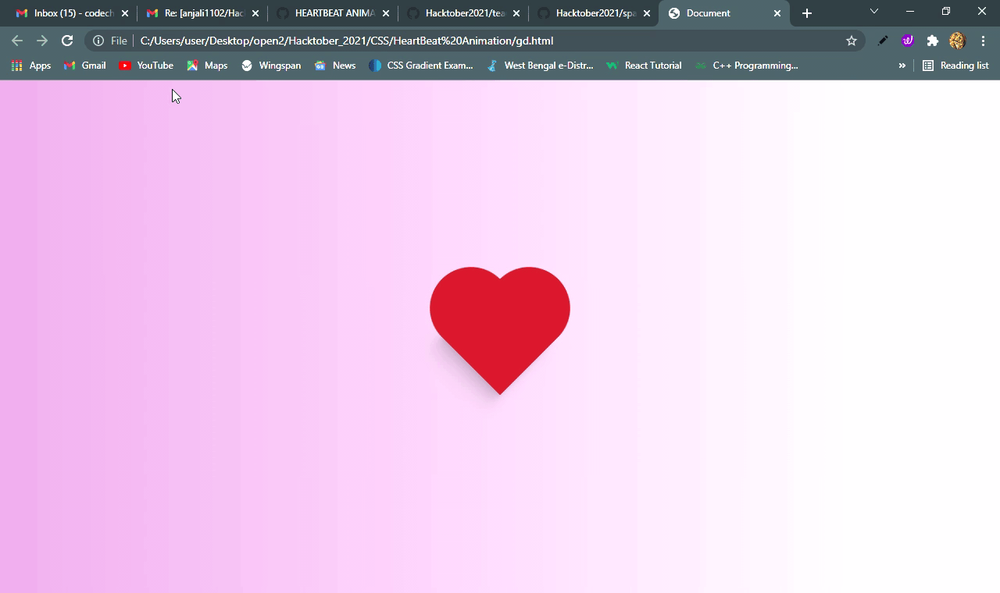

# Welcome To Hacktober 2022 👋

**Devkit** is a open source project which contains different code of frontend Projects with HTML, CSS, JS, REACT, ANGULAR and APIs etc. which makes your life easier for learning frontend. _You can submit your projects or raise/claim issues on existing projects_

    

### We have also take codes from Udemy,30 days of javascript and many more

## 📌 Introduction

DevKit is open source collection of frontend project made with HTML, CSS, Javascript, React, APIs, Angular etc for uplifting Creative thinking over Binge watching tutorials.

## 💥 How to Contribute?

- Take Existing [Issues](https://github.com/anjali1102/Hacktober2022/issues) or create your own Issues! ⚙️
- Get Assigned with Issues 🤖
- Fork the Repo, then Clone forked repo.
- Create a Pull Request. 🏃‍
- Add _Screenshots/deployed link_ in your project repo README.md🥺🥺
- [Contribution Guide](https://github.com/anjali1102/Hacktober2021/blob/master/CONTRIBUTING.md)

# Show some ❤️ by staring ⭐️ this repository.

## 💻 Languages used in this project

</img>
</img>
</img>

# Screenshots

<table>
  <tr>
    <td>Fire Particle</td>
     <td>Space Animation☄</td>
     <td>Brick Breaker</td>
  </tr>
  <tr>
    <td></td>
    <td></td>
    <td></td>
  </tr>
  <tr>
    <td>CSS Animation Bus</td>
     <td>Resume</td>
     <td>Confetti Animation</td>
  </tr>
  <tr>
    <td></td>
    <td></td>
    <td></td>
  </tr>
    <tr>
    <td>Drawing Board</td>
     <td>guess Game</td>
     <td>Guess Number</td>
  </tr>
  <tr>
    <td></td>
    <td></td>
    <td></td>
  </tr>
  <tr>
    <td>Joke generator</td>
    <td>Quote generator</td>
    <td>REACT~PASSWORD~GENERATOR</td>
  </tr>
  <tr>
    <td></td>
    <td></td>   
    <td></td>
  </tr>
  <tr>
    <td>Tesla Clone</td>
    <td>Simple Login-register</td>
    <td>Wikipedia Viewer</td>
      <td>expense tracker</td>
  </tr>
  <tr>
    <td></td>
    <td></td>
    <td></td>
  <td></td>  
          
  </tr>
  <tr>
    <td>advice generator</td>

    
    <td>Progress Steps</td>
  </tr>
   <tr>
   <td>
   
   </td>
    <td></td>   
  </tr>

 </table>
