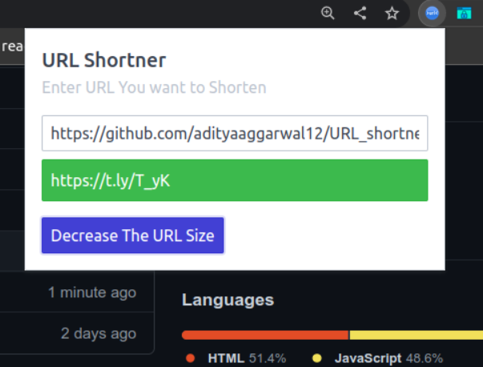

# URL Shortner Extension

A chrome extension to shorten long URLs

## HOW TO USE
 Download the files
 
 visit - chrome://extensions/ 

 Turn on Developer Options and click on load unpacked
 and load the files and extension will be loaded and now you can use it

 to view the stats of the shortened URLs

 Right click on extension and click options and enter your t.ly api key

 To get the api key make an account on t.ly

 now you can use the extension to view stats on t.ly website
 
